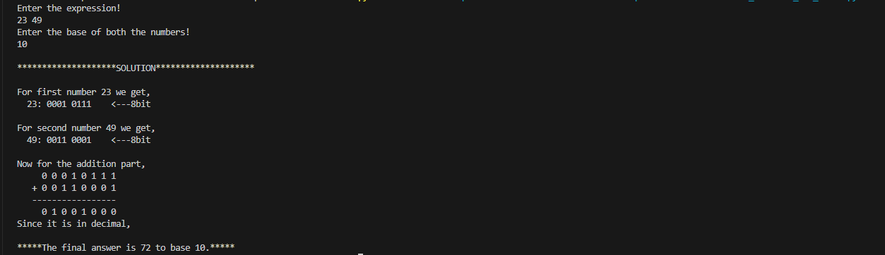
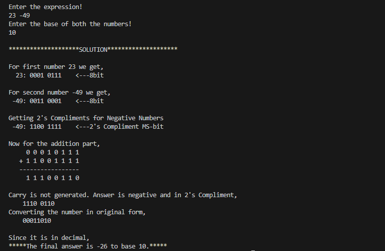
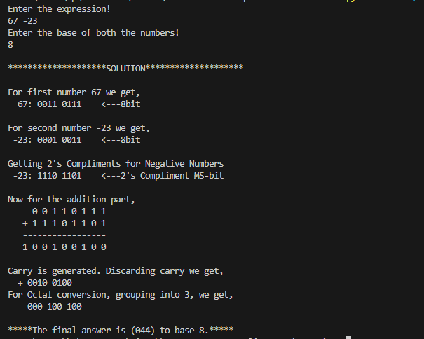

This code performs addition/subtraction of all possible base numbers.
You can input numbers with base as
2 - binary
8 - octal
16 - hexdecimal

Then it gives step by step procedures to perform the required opeartion.
There are many websites avaialbe which performs the following operation,
but none of them gives you a detailed solution.

This project can be a good starting point for understanding the basics of python, as there is a long way to go in the likes of Machine Learning, Data Science and much more. This project was created as a part of a mini-project for college and the topic was chosen as many people find difficulty in performing subtraction and 2's compliment concept.
This type of operations are not used anymore and is just a serves as a good challenge to strengthen your basics of maths as well as code.

Here are few examples->

Positive answer with base 10

Negative answer with base 10

Positive answer with base 8

NOTE: Hexadecimal part is not 100% done and contain errors while doing subtraction part,
Feel free to have a look and debug it! 😅